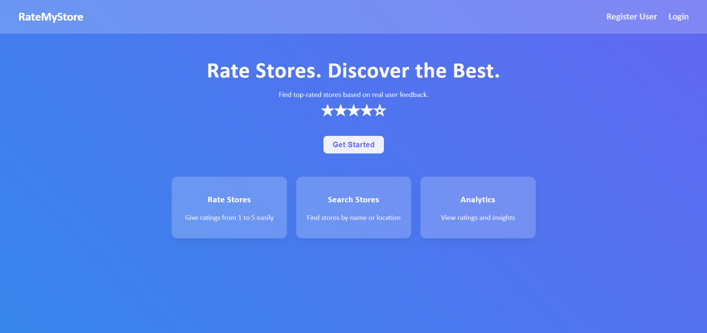
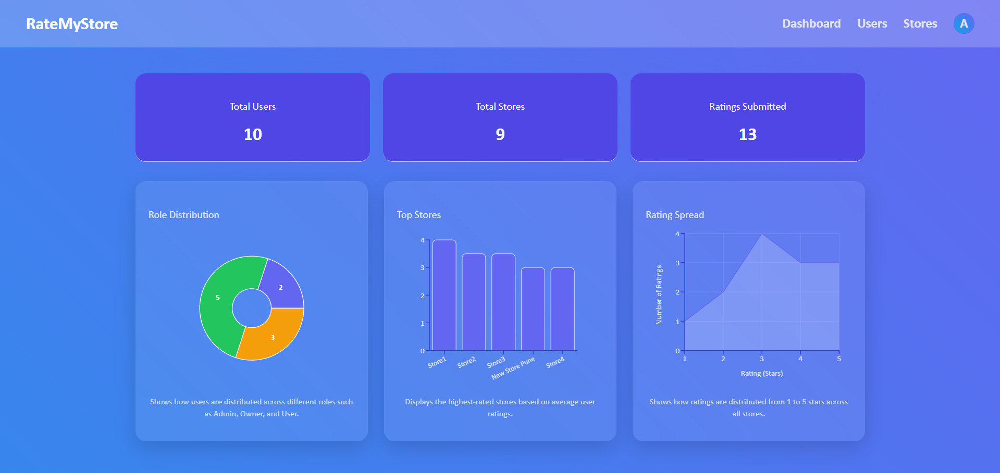
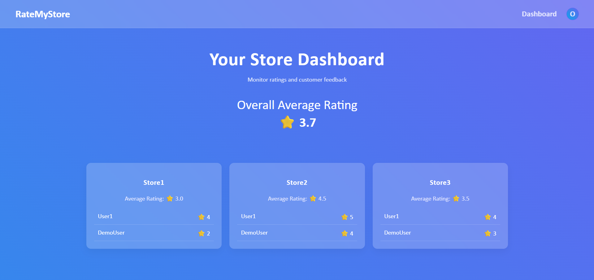
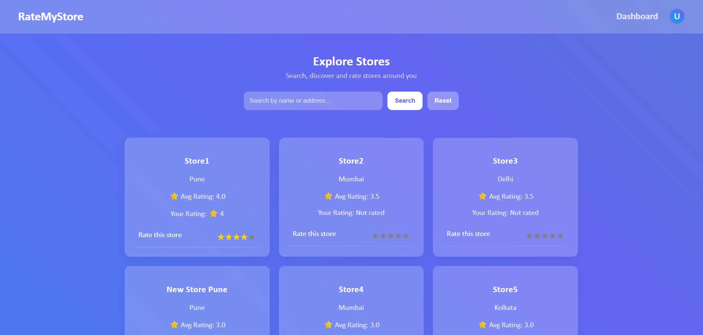

# RateMyStore (Store Rating Platform)

### Full Stack Intern Coding Challenge Submission

A role-based full-stack web application that allows users to rate stores, while providing dedicated dashboards for administrators and store owners.

---

## Overview

This application enables users to:

* Register and log in
* Browse and search stores
* Submit and update ratings (1–5 scale)

It also provides:

* Admin dashboard with analytics
* Store owner dashboard with insights
* Secure authentication and role-based access

---

## Tech Stack

### Frontend

* React.js (Vite)
* CSS (Glass UI Design)
* Recharts (Data Visualization)

### Backend

* Node.js
* Express.js
* JWT Authentication

### Database

* MySQL

---

## User Roles & Functionalities

---

### System Administrator

* Add new users (Admin/User/Owner)
* Add new stores
* View dashboard:

  * Total Users
  * Total Stores
  * Total Ratings
* View and manage:

  * Users (Name, Email, Address, Role)
  * Stores (Name, Email, Address, Rating)
* Filter data by:

  * Name, Email, Address, Role
* View store owner ratings
* Logout securely

---

### Normal User

* Register & Login
* View all stores
* Search stores by Name & Address
* Submit rating (1–5)
* Modify rating
* View:

  * Store rating
  * Own rating
* Update profile & password
* Logout

---

### Store Owner

* Login
* View owned stores
* See:

  * Average rating
  * Users who rated their store
* Update password
* Logout

---

## Form Validations

| Field    | Rules                                     |
| -------- | ----------------------------------------- |
| Name     | 20–60 characters                          |
| Address  | Max 400 characters                        |
| Password | 8–16 chars, ≥1 uppercase, ≥1 special char |
| Email    | Valid email format                        |

---

## Features

* JWT Authentication
* Role-based access control
* Rating system (1–5)
* Search & filter functionality
* Admin analytics dashboard
* Responsive UI
* Glassmorphism UI design
* Charts using Recharts
* Secure password hashing

---

## Project Structure

```bash
store-rating-app/
│
├── backend/
│   ├── src/
│   │   ├── config/
│   │   │   └── db.js                # Database connection
│   │   │
│   │   ├── controllers/            # Handles request/response logic
│   │   │   ├── auth.controller.js
│   │   │   ├── user.controller.js
│   │   │   ├── admin.controller.js
│   │   │   ├── store.controller.js
│   │   │   ├── rating.controller.js
│   │   │   └── owner.controller.js
│   │   │
│   │   ├── services/               # Business logic layer
│   │   │   ├── auth.service.js
│   │   │   ├── admin.service.js
│   │   │   ├── store.service.js
│   │   │   └── rating.service.js
│   │   │
│   │   ├── models/                 # Database queries
│   │   │   ├── user.model.js
│   │   │   ├── store.model.js
│   │   │   ├── rating.model.js
│   │   │   ├── admin.model.js
│   │   │   └── owner.model.js
│   │   │
│   │   ├── routes/                 # API routes
│   │   │   ├── auth.routes.js
│   │   │   ├── user.routes.js
│   │   │   ├── admin.routes.js
│   │   │   ├── store.routes.js
│   │   │   ├── rating.routes.js
│   │   │   └── owner.routes.js
│   │   │
│   │   ├── middleware/             # Custom middleware
│   │   │   ├── auth.middleware.js
│   │   │   ├── role.middleware.js
│   │   │   └── validation.middleware.js
│   │   │
│   │   ├── utils/                  # Helper functions
│   │   │   ├── hash.js
│   │   │   ├── jwt.js
│   │   │   └── response.js
│   │   │
│   │   ├── app.js                  # Express app setup
│   │   └── server.js               # Entry point
│   │
│   ├── package.json
│   └── .env.example
│
├── frontend/
│   ├── src/
│   │   ├── assets/                 # Images, icons
│   │   │
│   │   ├── components/
│   │   │   ├── common/             # Shared components
│   │   │   │   ├── AppHeader.jsx
│   │   │   │   ├── AdminLayout.jsx
│   │   │   │   ├── DataTable.jsx
│   │   │   │   ├── ProtectedRoute.jsx
│   │   │   │   ├── EditProfile.jsx
│   │   │   │   └── ChangePassword.jsx
│   │   │   │
│   │   │   ├── dashboard/          # Admin dashboard components
│   │   │   │   ├── UserTable.jsx
│   │   │   │   ├── RatingTable.jsx
│   │   │   │   └── AdminStats.jsx
│   │   │   │
│   │   │   └── store/              # Store-related components
│   │   │       ├── StoreCard.jsx
│   │   │       ├── StoreList.jsx
│   │   │       └── RatingStars.jsx
│   │   │
│   │   ├── pages/
│   │   │   ├── auth/
│   │   │   │   ├── Login.jsx
│   │   │   │   └── Register.jsx
│   │   │   │
│   │   │   ├── admin/
│   │   │   │   ├── Dashboard.jsx
│   │   │   │   ├── Users.jsx
│   │   │   │   └── Stores.jsx
│   │   │   │
│   │   │   ├── owner/
│   │   │   │   └── Dashboard.jsx
│   │   │   │
│   │   │   └── user/
│   │   │       └── Home.jsx
│   │   │
│   │   ├── services/               # API calls
│   │   │   ├── api.js
│   │   │   ├── auth.service.js
│   │   │   ├── user.service.js
│   │   │   ├── admin.service.js
│   │   │   ├── store.service.js
│   │   │   └── rating.service.js
│   │   │
│   │   ├── context/                # Global state
│   │   │   └── AuthContext.jsx
│   │   │
│   │   ├── routes.jsx              # All routes
│   │   ├── App.jsx                 # Root component
│   │   ├── main.jsx                # Entry point
│   │   └── index.css               # Global styles
│   │
│   ├── public/
│   ├── index.html
│   ├── package.json
│   └── vite.config.js
│
├── database/
│   ├── schema.sql                 # DB structure
│   └── seed.sql                   # Sample data
│
├── screenshots/                   # Project screenshots
│
├── README.md
└── .gitignore
```

---

## Setup Instructions

---

### 1️. Clone Repository

```bash
git clone https://github.com/VaibhavWasamkar/RateMyStore
cd store-rating-app
```

---

### 2️. Backend Setup

```bash
cd backend
npm install
```

Create `.env` file:

```env
PORT=5000
DB_HOST=localhost
DB_USER=root
DB_PASSWORD=yourpassword
DB_NAME=store_rating
JWT_SECRET=your_secret_key
```

Run backend:

```bash
npm run dev
```

---

### 3️. Frontend Setup

```bash
cd frontend
npm install
npm run dev
```

---

## API Endpoints

### Auth

* POST `/api/auth/register`
* POST `/api/auth/login`

### User

* GET `/api/user/profile`
* PUT `/api/user/profile`
* PUT `/api/user/change-password`

### Store

* GET `/api/stores`
* GET `/api/stores/search`

### Rating

* POST `/api/ratings`

### 🛠 Admin

* GET `/api/admin/dashboard`
* GET `/api/admin/users`
* GET `/api/admin/stores`

---

## Screenshots

### Main Home Page



### Admin Dashboard



### Store Owner Dashboard



### Normal User Dashboard



---

## Key Highlights

* Clean and modular architecture
* Separation of concerns (MVC pattern)
* Secure authentication with JWT
* Optimized database queries
* Reusable components
* Professional UI/UX

---

## Future Improvements

* Email verification & password reset
* Image upload for stores
* Pagination & lazy loading
* Notifications system
* Deployment (Vercel + Render)

---

## Author

**Vaibhav Wasamkar**

---

## Notes

* This project follows best practices for both frontend and backend
* Database schema is optimized with indexing & constraints
* Fully functional and production-ready structure

---

## Conclusion

This project demonstrates:

* Full-stack development skills
* Role-based system design
* Secure authentication
* Real-world application architecture

---

Thank you for reviewing this submission!
